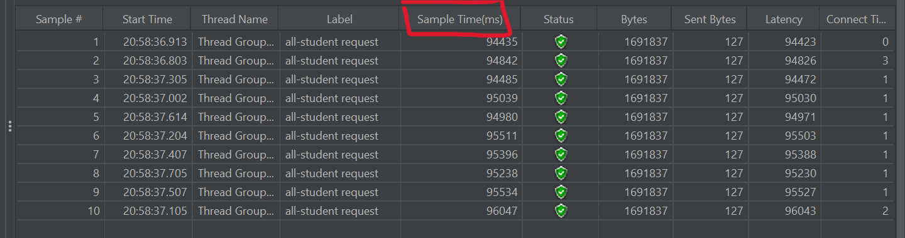
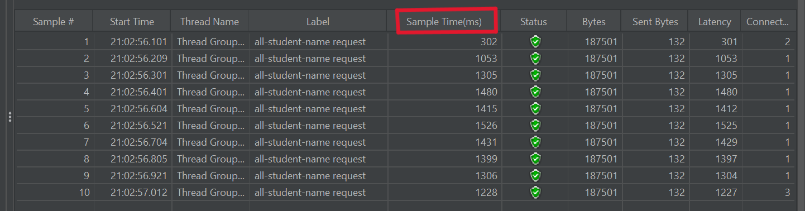
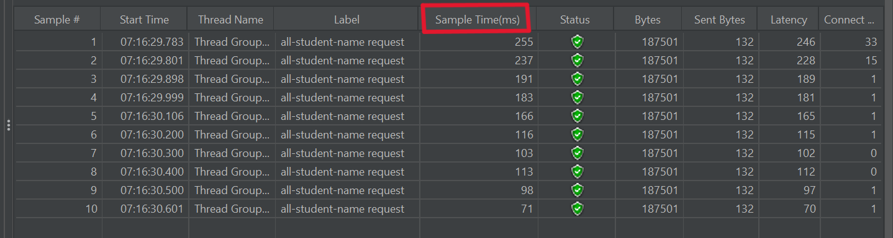

# Daftar Isi
- [Performance Testing](#performance-testing)
- [Profiling & Performance Optimization](#profiling--performance-optimization)
- [Reflection](#reflection)

# Performance Testing
## Results on GUI
- **/all-student**

- **/all-student-name**

- **/highest-gpa**

## Results on command line
- **/all-student**
  
- **/all-student-name**
  
- **/highest-gpa**
  
# Profiling & Performance Optimization
- **/all-student**

|                           Before                           |
|:----------------------------------------------------------:|
|    |

|                            After                            |
|:-----------------------------------------------------------:|
|  |

- **/all-student-name**

|                            Before                             |
|:-------------------------------------------------------------:|
|  |

|                              After                               |
|:----------------------------------------------------------------:|
|  |

- **/highest-gpa**

|                           Before                            |
|:-----------------------------------------------------------:|
|     |

|                            After                            |
|:-----------------------------------------------------------:|
|  |

**conclusions/explanations**:
Dapat dilihat dari gambar _before-and-after_ bahwa semua metode mengalami penurunan _sample time_ yang sangat signifikan, lebih dari 20%. Berikut adalah penjelasan masing-masing _refactoring_:

- **getAllStudentsWithCourses**: Proses refactoring berhasil mengurangi _sample time_ dari sekitar 9 detik menjadi sekitar 1 detik. Sebelum refactoring, fungsi ini mengambil setiap siswa dan mencari kursus yang mereka ikuti secara terpisah, yang bisa menjadi tidak efisien. Setelah refactoring, kode mengambil semua siswa dan semua kursus sekaligus, kemudian mengelompokkan kursus berdasarkan ID siswa. Hal ini membuat prosesnya lebih cepat dan lebih rapi.
- **joinStudentNames**: Proses refactoring berhasil mengurangi _sample time_ dari sekitar 1 detik menjadi sekitar 200 milidetik. Sebelumnya, fungsi ini menggunakan tipe data String untuk menggabungkan nama-nama siswa, yang bisa menjadi kurang efisien karena String bersifat immutable. Setelah refactoring, kode menggunakan StringBuilder, yang merupakan struktur data yang lebih efisien untuk memanipulasi string secara dinamis.
- **findStudentWithHighestGpa**: Proses refactoring berhasil mengurangi _sample time_ dari sekitar 1 detik menjadi sekitar 100 milidetik. Sebelumnya, fungsi ini menggunakan perulangan untuk mencari siswa dengan GPA tertinggi, yang memerlukan lebih banyak kode dan memiliki kompleksitas waktu yang lebih tinggi. Setelah refactoring, kode menggunakan metode fungsional dari Java Stream API, yaitu max() dengan Comparator yang membandingkan GPA siswa.

# Reflection
1. JMeter berfokus pada simulasi _user traffic_ untuk menguji kinerja aplikasi secara keseluruhan, sedangkan IntelliJ Profiler lebih memusatkan perhatian pada analisis detail kode aplikasi untuk menemukan penyebab penurunan performa, seperti kebocoran memori atau bottleneck CPU.
2. Proses profiling membantu saya melihat di mana aplikasi menghabiskan waktu dan sumber daya, sehingga saya dapat menemukan area-area yang memerlukan perbaikan, seperti kebocoran memori atau bottleneck CPU.
3. Secara pribadi, saya merasa IntelliJ Profiler sangat efektif dalam membantu menganalisis dan mengidentifikasi bottleneck dalam kode aplikasi. Fitur-fitur seperti analisis heap dan CPU profiling memberikan informasi tentang bagaimana aplikasi beroperasi di tingkat yang sangat rinci.
4. Beberapa tantangan utama dalam _performance testing_ dan _profiling_ termasuk menentukan beban pengujian yang tepat, memahami hasil pengujian, dan mengetahui bagaimana dan di mana melakukan optimalisasi.
5. IntelliJ Profiler memberikan manfaat seperti visualisasi runtime yang mendalam, pelacakan function call, dan analisis alokasi memori.
6. Jika hasil dari IntelliJ Profiler tidak konsisten dengan temuan dari _performance testing_ menggunakan JMeter, saya akan memeriksa konfigurasi tes dan mungkin melakukan pengujian ulang untuk memverifikasi hasil. Jika ada perbedaan yang signifikan, saya akan mencoba untuk mengidentifikasi faktor-faktor yang mungkin memengaruhinya, seperti perbedaan dalam cara aplikasi digunakan oleh pengguna nyata dibandingkan dengan simulasi.
7. Strategi yang saya terapkan meliputi perbaikan algoritma, pengurangan pemanggilan fungsi yang tidak perlu, dan penggunaan caching untuk mengurangi beban kerja. Untuk memastikan perubahan tidak mempengaruhi fungsionalitas aplikasi, saya memastikan bahwa masukan dan keluaran setiap fungsi tidak berubah.
